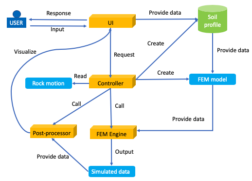

.. _lbl-architecture:

Software Architecture
=====================

The |s3harkName| application is designed following the architecture shown in :numref:`fig_architecture`.
The use provide input in the UI. 
Based on the user's input, the controller creates soil profile.
The the controller creates a finite element model for the soil profile.
Then the controller reads the rock motion file and call the finite element engine to perform the simulation. 
Upon the complete of the simulation, the controller calls the post-processor to read the simulated result and visualizes the post-processed result in the UI.  

.. _fig_architecture:

   Diagram for architecture of the application