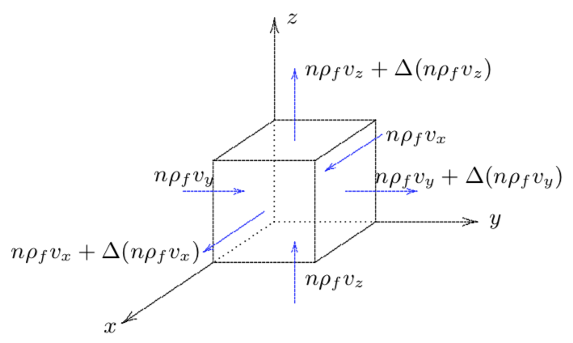

Theory and Implementation
==========================

Site-Response Analysis in Geotechnical Earthquake Engineering
--------------------------------------------------------------
Earthquake loads are transferred to the foundations of the structures, 
in the form of accelerations at the ground-structure interfaces.
Therefore, an essential part of earthquake engineering is to determine the surficial ground motion.

In earthquake scenarios, the ruptures of faults generate seismic wave, which is
then transmitted and modified by path effects (wave scattering, anelastic attenuation, and geometric spreading) 
and further site effects when it is transmitted through soil layers before it reaches the ground surface. 
Site effects are known to have a profound influence on surficial ground motions due to the variabilities in surficial geology 
and the complexity in its characterization, especially when the site needed to be considered with nonlinearity.

Site response analysis is widely employed to quantify site effects. 
It simulates the propagation of seismic waves from the bed rock to the ground surface, going through soil deposits.

One-dimensional (1D) site response analyses are simplified methods that are commonly used due to their simplicity and cost efficiency. 
These simplified methods employ constitutive models based on a variation of the hyperbolic model to represent the initial stress-strain backbone curve.

..
  Equivalent linear analyses in frequency domain and the nonlinear analyses in time domain are the commonly used approaches for one dimensional site response modeling.

|s3harkName| has been developed to allow site response analyses to be performed taking into account: 
(1) the nonlinear anisotropic and hysteretic stress-strain behavior of the soil materials; and 
(2) the effects of the transient flow of the pore water through the soil strata. 
The procedures used (field and constitutive equations) are general and applicable to multidimensional situations.

Basics concepts of dynamics of porous media
--------------------------------------------------------------
Soils consist of an assemblage of particles with different sizes and shapes which form a skeleton whose voids 
are filled with water and air or gas. The word "soil" therefore implies a mixture of assorted mineral grains 
with various fluids. 
Hence, soil in general must be looked at as a one (dry soil) or two (saturated soil) or 
multiphase (partially saturated soil) material whose state is to be described by the stresses and displacements (velocities) within each phase. 
There are still great uncertainties on how to deal analytically with partly saturated soils. 
Attention is therefore restricted in the following to dry and fully saturated soils. 
The stresses carried by the soil skeleton are conventionally called "effective stresses" in the soil mechanics literature 
(see e.g., :cite:`terzaghi1943theoretical`), 
and those in the fluid phase are called the "pore fluid pressures".

In a saturated soil, when free drainage conditions prevail, the steady state pore-fluid pressures 
depend only on the hydraulic conditions and are independent of the soil skeleton response to external loads. 
Therefore, in that case, a single phase continuum description of soil behavior is certainly adequate. 
Similarly, a single phase description is also adequate when no drainage (i.e., no flow) conditions prevail. 
However, in intermediate cases in which some flow can take place, there is an interaction between the skeleton strains and the pore-fluid flow. 
The solution of these problems requires that soil behavior be analyzed by incorporating the effects of the transient flow of the pore-fluid through the voids, 
and therefore requires that a two phase continuum formulation be available for porous media. 
Such a theory was first developed by Biot :cite:`biot1955theory` for an elastic porous medium.
However, it is observed experimentally that the stress-strain strength behavior of the soil skeleton is strongly non-linear, anisotropic, hysteretic and path-dependent.
An extension to the Biot's theory into the non-linear anelastic range is therefore necessary in order to analyze the transient response of soil deposits. 
This extension has acquired considerable importance in recent years due to the increased concern with the dynamic behavior of saturated soil deposits and 
associated liquefaction of saturated sand deposits under seismic loading conditions. 
Such an extension of Biot's formulation :cite:`prevost1980mechanics` has been developed in recent years. 
In the extended theory, soil is viewed as a multi-phase medium (Green and Naghdi :cite:`green1965dynamical`, 
and Eringen and Ingram :cite:`eringen1965continuum,ingram1967continuum`). 
General mixture results can be shown through formal linearization of the field and constitutive equations, 
to reduce to Biot's linear poroelastic model.
 
.. 
    Kinematics
    --------------------------------------------------------------  
    Soil is viewed herein as a mixture consisting of m (:math:`1 \leq m \leq 2`) deformable media,
    each of which is regarded as a continuum (for saturated soils m=2), and each following its own motion.
    Is is assumed that at any time :math:`t` each place :math:`\boldsymbol{x}` of the mixture is occupied simultaneously by :math:`m` different particles 
    :math:`\boldsymbol{X}^1`, :math:`\boldsymbol{X}^2`, ..., :math:`\boldsymbol{X}^m`, one for each constituent.
    As in single-phase theory, to each constituent is assigned a fixed but otherwise arbitrary reference configuration, and a motion

    .. math::   
        \boldsymbol{x} = \boldsymbol{x}^\alpha(\boldsymbol{X}^\alpha, t) \;\;\;\;\;\;\;\;  \alpha = 1,...,m 
    where :math:`\boldsymbol{X}^\alpha` denotes the position of the :math:`\alpha^{th}` constituent in its reference configuration, 
    and :math:`x` the spatial position occupied at time :math:`t` by the particle labeled :math:`\alpha`.
    For simplicity in the following, both the reference and current configurations of each constituent are referred to rectangular Cartesian axes. 
    Capital and lower case letters are used for the indices on coordinates and tensors referred to the undeformed and deformed configuration, respectively. 
    The usual continuity and differentiability assumptions are made for the deformation function :math:`\boldsymbol{x}^\alpha`, and the following restrictions are imposed  
    .. math::   
        det|\boldsymbol{x}_a^{\alpha}, A|=f^\alpha(\boldsymbol{X}^\alpha, t); det|\boldsymbol{x}_a^{\alpha}, b|> 0 
        \;\;\;\;\;\;\;\; \alpha = 1,...,m   
    for physically possible motions, in which det denotes the determinant and a comma (,) a partial derivative. 
    The velocity and acceleration of 

Balance laws
--------------------------------------------------------------

Darcy's laws
^^^^^^^^^^^^^^
From experiments conducted in 1857, Darcy found that the specific discharge of a fluid in 
a porous media is proportional to the loss of water head. 

.. math::
    :label: eq:darcy

    \boldsymbol{q} = -\frac{\kappa}{\mu}(\nabla p - \rho_f\boldsymbol{g})

where :math:`\kappa` is the intrinsic permeability of the porous material, 
:math:`\mu` is the viscosity of the fluid, and :math:`g` is the gravity vector. 
The value of permeability depends upon the size of the voids. 
As a first approximation one may consider that the permeability 
:math:`\kappa` is proportional to the square of the particle size.   

Effective stress
^^^^^^^^^^^^^^^^^^

Stresses applied to a saturated porous media are distributed to the solid skeleton and the pore fluid according to a propotion. 
The former stresses are responsible for skeletal deformations, this is why they are called effective. 
Considering that stresses are positive when they are tensile and pressure is positive when it is compressive, 
the principle of effective stress is written in index notation as

.. math::
    :label: eq:effective_stress

    \sigma = \sigma^{\prime} - \alpha p

The parameter :math:`\alpha` is Biot's coefficient. 
In 1941, it is defined as :cite:`biot1941general`

.. math::
    :label: eq:biot_1

    \alpha = \frac{K}{H}

where :math:`K` is the drained bulk modulus of the porous media, 
and :math:`1/H` is the poroelastic expansion coefficient.
In 1957, this parameter was redefined by Biot and Willis :cite:`biot1957elastic`
in terms of jacketed compressibility and unjackedted compressibility.

.. math::
    :label: eq:biot_2

    \alpha = 1- \frac{\chi_s}{\chi}

The jacketed compressibility coefficient, :math:`\chi`, is the drained compressibility of the porous material.
The unjacketed coefficient of compressibility, :math:`\chi_s`, is the compressibility of the solid phase.

Balance of fluid mass
^^^^^^^^^^^^^^^^^^^^^^
One of the major principles of the theory of poromechanics is that the mass of the two constituent, solid particles and the fluid, 
must be conserved. Its formulation is presented as following.

.. _infinitesimal:

	Fluid mass conservation of a infinitesimal unit

Consider a porous medium, comprising a solid matrix (an assembly of soil particles, with a continuous pore space). 
The pore space is filled with a fluid. 
The average velocity of the fluid is denoted by :math:`v_f` and the average velocity of the solid skeleton is denoted by :math:`v_s`.
The densities are denoted by :math:`\rho_{f}` and :math:`\rho_{s}`, respectively, and the porosity by :math:`n`.

The equations of mass conservation of the infinitesimal unit can be established by considering the flow into and out of the unit (:numref:`infinitesimal`).
The mass of the fluid in the infinitesimal unit with volume :math:`V` is :math:`n\rho_{f}V`. 
The increment of this mass per unit time can be calculated based on the net flux across the surfaces of the unit. Thus, the fluid mass balance equation is

.. math::
  :label: eq:mass_balance_0

  \frac{\partial (n\rho_{f}V)}{\partial t} + \frac{\partial (n\rho_{f}v_{x})}{\partial x}V 
  + \frac{\partial (n\rho_{f}v_{y})}{\partial y}V 
  + \frac{\partial (n\rho_{f}v_{z})}{\partial z}V
  + Q_{m}V
  = 0

Rewriting Equation :eq:`eq:mass_balance_0` in vector form leads to

.. math::
  :label: eq:mass_balance_1

    \frac{\partial (n\rho_f)}{\partial t} + \nabla \cdot (n\rho_{f}\boldsymbol{v}_f) + {Q_m} = 0

where :math:`\boldsymbol{v}_f` is the vector expression for fluid velocity; :math:`Q_m` is the fluid source.
In order to decompose :math:`\frac{\partial (n\rho_f)}{\partial t}` in Equation :eq:`eq:mass_balance_1`, 
a parameter, fluid compressibility, :math:`\chi`, is introduced here.
Fluid compressibility is related to the change in fluid pressure and the fractional change in fluid volume. 
Its definition is 

.. math::
    :label: eq:compressibility_def

    \chi = - \frac{1}{V_f} \frac{\Delta_f}{\Delta_p}

In a constant fluid, the continuity of mass requires that :math:`\rho_{fr}V_{fr} = \rho_{fc}V_{fc}`, in which 
the subscription :math:`f` represent 'fluid', :math:`r` and :math:`c` represent the reference and current configuration, respectively. 
Inserting the differential expressions :math:`V_f = V_{fr} + \Delta V_f` and :math:`\rho_f = \rho_{fr} + \Delta \rho_f` into the mass continuity equation produces
:math:`\frac{\Delta V_f}{V_{fr}} = - \frac{\Delta \rho_f}{\rho_f}`. In the assumption of small perturbations, i.e., change in :math:`V` is neglected, the equation 
rewrites as

.. math::
    :label: eq:continuity_fluid

    \frac{\partial V_f}{V_f} = - \frac{\partial \rho_f}{\rho_f}

Equations :eq:`eq:compressibility_def` and :eq:`eq:continuity_fluid` facilitate the expression of :math:`\frac{\partial \rho_f}{\partial t}` using fluid pressure :math:`p`

.. math::
    :label: eq:partial_rho_partial_t

    \frac{\partial \rho_f}{\partial t} = \rho_f \chi \frac{\partial p}{\partial t}

Therefore, the fluid mass balance equation :eq:`eq:mass_balance_1` rewrites as

.. math::
  :label: eq:mass_balance_2

    \frac{\partial n}{\partial t} + n\chi \frac{\partial p}{\partial t} + \nabla \cdot (n\boldsymbol{v}_f) + \frac{Q_m}{\rho_f} = 0

Balance of solid mass
^^^^^^^^^^^^^^^^^^^^^^^
In the infinitesimal unit, the mass of the solid skeleton is :math:`m_s=(1-n)\rho_s V` and its relative density is :math:`(1-n)\rho_s`.
Similar to the mass balance of fluid, the mass balance of solid is

.. math::
  :label: eq:mass_balance_solid

    \frac{\partial [(1-n)\rho_s]}{\partial t} + \nabla \cdot [(1-n)\rho_{f}\boldsymbol{v}_s] = 0

Consider the infinitesimal unit is loaded with an isotropic compressive stress :math:`\Delta P` under undrained conditions.
The mean stresses caused by the loading is

.. math::
    :label: eq:meanstress

    \Delta \sigma = - \Delta P

In the following analysis, the load is divided into two stages when applied to the unit.
In the first stage, the load only caused an increase of :math:`\Delta p` in the pore pressure.
In the second, the pore pressure will be kept unchanged, while the pressure on the unit will be increased with the magnitude of :math:`\Delta P - \Delta p`.

In the first stage, two definitions are useful: The unjacketed bulk compressibility of the solid phase

.. math::
    :label: eq:Cs

    \chi_s = - \frac{1}{V} \frac{\Delta V}{\Delta p}

and the unjacketed fluid compressibility

.. math::
    :label: eq:C_phi

    \chi_{\phi} = - \frac{1}{V_f} \frac{\Delta V_f}{\Delta f}

The factional volume change of the solid phase is

.. math::
    :label: eq:volumechange

    \frac{\Delta V_s}{V_s} = \frac{\Delta V}{V_s} - \frac{\Delta V_p}{V_s}
    = \frac{\Delta V}{(1-n)V} - \frac{n \Delta V_p}{V_p}

With Equations :eq:`eq:Cs` and :eq:`eq:C_phi`, the volume change Equation :eq:`eq:volumechange` rewrites

.. math::
    :label: eq:volumechange_rewrite

    \frac{\Delta V_s}{V_s} = \frac{n \chi_{\phi} \Delta p - \chi_s \Delta p}{1-n}

In the second stage, the effective stress applied on the solid skeleton will be :math:`\Delta \sigma ^{\prime} = (\Delta P - \Delta p)/(1-n)`.
The definition of the compressibility of the solid phase :math:`\chi_{s} = -\frac{1}{V_s} \frac{\Delta V_s}{\Delta \sigma^{\prime}}` yields

.. math::
    :label: eq:compressibility_rewrite

    \frac{\Delta V_s}{V_s} = \frac{-\chi_s(\Delta P - \Delta p)}{1-n}

Adding Equations :eq:`eq:volumechange_rewrite` and :eq:`eq:compressibility_rewrite` and with the help of Equation :eq:`eq:meanstress` yields

.. math::
    :label: eq:compressibility_rewrite_final

    \frac{\Delta V_s}{V_s} = \frac{\chi_s \Delta \sigma + n \chi_{\phi} \Delta p }{1-n}

Similar to Equation :eq:`eq:continuity_fluid`, the continuity of the solid phase requires

.. math::
    :label: eq:continuity_solid

    \frac{\partial V_s}{V_s} = - \frac{\partial \rho_s}{\rho_s}

Combining Equations :eq:`eq:compressibility_rewrite_final` and :eq:`eq:continuity_solid` yields:
the constitutive law for the solid phase

.. math::
    :label: eq:constitutive_solid

    \frac{\partial \rho_s}{\partial t} = \frac{\rho_s}{1-n} 
    (-\chi_s \frac{\partial \sigma}{\partial t} -n \chi_{\phi} \frac{\partial p}{\partial t})

Inserting Equation :eq:`eq:constitutive_solid` into Equation :eq:`eq:mass_balance_solid`
gives

.. math::
    :label: eq:balance_solid_s

    -\frac{\partial n}{\partial t} +
    (-\chi_s \frac{\partial \sigma}{\partial t} -n \chi_{\phi} \frac{\partial p}{\partial t})
    +\nabla \cdot \boldsymbol{v}_s 
    = \nabla \cdot (n\boldsymbol{v}_s)

Noticing the fluid mass balance Equation :eq:`eq:mass_balance_2` can be expressed with :math:`\boldsymbol{v}_s`

.. math::
  :label: eq:mass_balance_3

    \frac{\partial n}{\partial t} + n\chi \frac{\partial p}{\partial t} 
    + \nabla \cdot [n(\boldsymbol{v}_f - \boldsymbol{v}_s)] 
    + \nabla \cdot (n\boldsymbol{v}_s)
    + \frac{Q_m}{\rho_f} = 0

Substituting Equation :eq:`eq:balance_solid_s` into the fluid mass balance Equation
:eq:`eq:mass_balance_3`

.. math::
    :label: eq:balance_fluid_f

    \nabla \cdot \boldsymbol{v}_s 
    + n(\chi - \chi_{\phi}) \frac{\partial p}{\partial t} 
    -\chi_s \frac{\partial \sigma}{\partial t}
    + \frac{Q_m}{\rho_f}
    = - \nabla \cdot [n(\boldsymbol{v}_f - \boldsymbol{v}_s)]

Noticing :math:`n(\boldsymbol{v}_f - \boldsymbol{v}_s) = \boldsymbol{q}`
and :math:`\nabla \cdot \boldsymbol{v}_s = \frac{\partial \epsilon}{\partial t}` is the time derivative of the volumetric strain,
Equation :eq:`eq:balance_fluid_f` becomes 

.. math::
    :label: eq:balance_fluid_f2

    \frac{\partial \epsilon}{\partial t} 
    + n(\chi - \chi_{\phi}) \frac{\partial p}{\partial t}
    -\chi_s \frac{\partial \sigma}{\partial t}
    + \frac{Q_m}{\rho_f}
    = - \nabla \cdot \boldsymbol{q}

Substituting the stress balance Equation :eq:`eq:effective_stress` and :math:`\sigma^{\prime} = \frac{\epsilon}{C}` into Equation :eq:`eq:balance_fluid_f2`,

.. math::
    :label: eq:balance_fluid_f3

    \alpha\frac{\partial \epsilon}{\partial t} 
    + S \frac{\partial p}{\partial t}
    + \frac{Q_m}{\rho_f}
    = - \nabla \cdot \boldsymbol{q}

in which :math:`S` is the dimensionless storage coefficient. 

Substituting Darcy's law :eq:`eq:darcy` into :eq:`eq:balance_fluid_f3` yields the final form of the fluid mass conversation equation

.. math::
    :label: eq:balance_fluid_f4

    \alpha\frac{\partial \epsilon}{\partial t} 
    + S \frac{\partial p}{\partial t}
    + \frac{Q_m}{\rho_f}
    = \nabla \cdot (\frac{\kappa}{\mu} \nabla p)

Note that the divergence of :math:`\rho_f\boldsymbol{g}` vanished in :eq:`eq:balance_fluid_f4`.

Constitutive laws 
--------------------------------------------------------------

The constitutive laws that are available in |s3harkName| are listed in Table :numref:`tabmat`.
The derivation of individual constitutive law can be found in the corresponding reference. 

.. _tabmat:

.. list-table:: Available material models
   :widths: 25 25 50
   :header-rows: 1

   * - Material models
     - Usage
     - Development Status
   * - ElasticIsotropic
     - 2D/3D
     - ✓
   * - PM4Sand
     - 2D
     - ✓
   * - PM4Silt
     - 2D
     - ✓
   * - PressureIndependMultiYield
     - 2D/3D
     - ✓
   * - PressureDependMultiYield
     - 2D/3D
     - ✓
   * - PressureDependMultiYield02
     - 2D/3D
     - ✓
   * - ManzariDafalias
     - 2D/3D
     - ✓
   * - Borja-Amies
     - 3D
     - ✓

ElasticIsotropic
^^^^^^^^^^^^^^^^^^^^^^

In the application, choosing `Elastic` as the material model will bring up the editing tab for this model.

PM4Sand
^^^^^^^^^^^^^^^^^^^^^^

Choosing `PM4Sand` as the material model will bring up the editing tab for the PM4Sand model.

The sand plasticity model PM4Sand (version 3) :cite:`boulanger2015pm4sand` follows the basic framework of the stress-ratio controlled, 
critical state compatible, 
bounding surface plasticity model for sand presented by :cite:`dafalias2004simple`. 
Modifications to the model were developed by :cite:`boulanger2015pm4sand` to improve its ability
to approximate the stress-strain responses important to geotechnical earthquake engineering applications; 
in essence, the model was calibrated at the equation level to provide for better approximation of the trends observed across a set of 
experimentally- and case history-based design correlations. 
The model is shown to provide reasonable approximations of desired behaviors and to be relatively easy to calibrate.

PM4Silt
^^^^^^^^^^^^^^^^^^^^^^

Choosing `PM4Silt` as the material model will bring up the editing tab for this model.

PM4Silt :cite:`boulanger2018pm4silt` is a plasticity model for representing low-plasticity silts and clays in geotechnical 
earthquake engineering applications. 
The PM4Silt model builds on the framework of the stress-ratio controlled, critical state compatible, 
bounding surface plasticity PM4Sand model. Modifications to the model were developed and implemented to improve instability 
to approximate undrained monotonic and cyclic loading responses of low-plasticity silts and clays, as opposed to those for 
purely nonplastic silts or sands. Emphasis was given to obtaining reasonable approximations of undrained monotonic shear strengths, 
undrained cyclic shear strengths, and shear modulus reduction and hysteretic damping responses across a range of initial static shear 
stress and overburden stress conditions. The model does not include a cap, and therefore is not suited for simulating consolidation 
settlements or strength evolution with consolidation stress history. The model is cast in terms of the state parameter relative to a 
linear critical state line in void ratio versus logarithm of mean effective stress. The primary input parameters are the undrained 
shear strength ratio (or undrained shear strength), the shear modulus coefficient, the contraction rate parameter, and an optional 
post-strong-shaking shear strength reduction factor.

PressureIndependMultiYield
^^^^^^^^^^^^^^^^^^^^^^^^^^^^^^^^^^^^^^^^^^^^

Choosing `PIMY` as the material model will bring up the editing tab for this model.
PressureIndependMultiYield material :cite:`gu2009finite` is an elastic-plastic material in which plasticity exhibits only 
in the deviatoric stress-strain response. The volumetric stress-strain response is linear-elastic and is 
independent of the deviatoric response. 
This material is implemented to simulate monotonic or cyclic response of materials whose shear behavior 
is insensitive to the confinement change. Such materials include, for example, organic soils or clay under 
fast (undrained) loading conditions.

PressureDependMultiYield and PressureDependMultiYield02
^^^^^^^^^^^^^^^^^^^^^^^^^^^^^^^^^^^^^^^^^^^^^^^^^^^^^^^^^^^^^^^^^^^^^^^^^^^^^^^^^^^^^^^^

Choosing `PDMY` or `PDMY02` as the material model will bring up the editing tab for these models.

PressureDependMultiYield and PressureDependMultiYield02 materials :cite:`yang2003computational` are elastic-plastic material for 
simulating the essential response characteristics of pressure sensitive soil mate- rials under general loading conditions. 
Such characteristics include dilatancy (shear-induced volume contraction or dilation) and non-flow liquefaction (cyclic mobility), 
typically exhibited in sands or silts during monotonic or cyclic loading.

Manzari-Dafalias
^^^^^^^^^^^^^^^^^^^^^^
Choosing `Manzari-Dafalias` as the material model will bring up the editing tab for this model.

Manzari Dafalias :cite:`dafalias2004simple` is a stress-ratio controlled, critical state compatible, sand plasticity model. 
A fabric-dilatancy related quantity, scalar valued in the triaxial and tensor valued in generalized stress space, 
which is instrumental in modeling macroscopically the effect of fabric changes during the dilatant phase of deformation 
on the subsequent contractant response upon load increment reversals, and the ensuing realistic simulation of the sand 
behavior under undrained cyclic loading. The dependence of the plastic strain rate direction on a modified Lode angle in 
the multiaxial generalization enables it to produce realistic stress-strain simulations in non-triaxial conditions. 
A very systematic connection between the simple triaxial and the general multi-axial formulation makes it possible to 
use correctly the model parameters of the former in the implementation of the latter.

Borja-Amies
^^^^^^^^^^^^^^^^^^^^^^
Choosing `J2Bounding` as the material model will bring up the editing tab for this model.

Borja-Amies :cite:`borja1994multiaxial` is a total stress-based bounding surface plasticity model for clays developed 
to accommodate multiaxial stress reversals. 
The model is constructed based on the idea of a vanishing elastic region undergoing pure translation inside a bounding surface, 
and an interpolation function for hardening modulus which varies with stress distance of the elastic region from the unloading point. 
Central to the development of the model are the general criteria for loading and unloading, which are phrased based upon the 
simple argument that with continued loading the hardening modulus should decrease monotonically with deformation. 
Combined with numerical integration of the elastoplastic constitutive equations in a form suitable for a robust computer implementation, 
the model is applied to cohesive soils undergoing undrained stress reversals and cyclic loading. With a suitable choice of the 
interpolation function for the hardening modulus, it is shown that existing one-dimensional nonlinear laws for soils can be replicated, 
such as the hyperbolic, exponential, the Davidenkov, and even the Ramberg-Osgood models. 
Specifically, the appropriateness of the exponential hardening function for cohesive soils is investigated and its parameters 
determined for some clays and silts for use in dynamic soil-structure interaction modeling.

.. bibliography:: references.bib

