.. _lbl-vnv:

Verification and Validation 
=============================

2D Column 1D Shaking
----------------------

A 2D free field effective stress analysis is performed by |s3harkName|
and demonstrated here.  The results are verified against FLAC and
Plaxis.  The soil column being analyzed is 6 meters high sitting on a
rock.  The ground water table is at 2 meters below the soil surface.
In the column, there are a total of three soil layers. Each layer is
meshed by elements with a size of 0.25 meter in height.  Basic
properties of soil layers and the rock are shown
in :numref:`fig_s3harkSoilColumn` and :numref:`fig_s3hark5`.  The
first two layers are modeled by PM4Sand and the third layer is modeled
by elastic isotropic material.  (The implementation work of
PM4Sand :cite:`boulanger2015pm4sand` is done in University of
Washington by Long Chen and Pedro Arduino.  Chaofeng Wang at UC,
Berkeley contributed to the code optimization for speed improvement. )
The rock layer will be simplified to a :cite:`Lysmer:1969` dashpot,
which accounts for the finite rigidity of the underlying elastic
medium.  The parameters of the dashpot are calculated solely based on
rock layer's density and :math:`V_{s30}`.

.. _fig_s3harkSoilColumn:

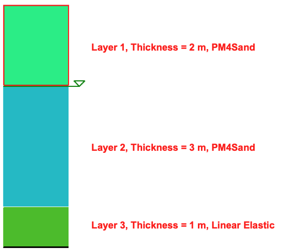

	Soil layers 

.. _fig_s3hark5:

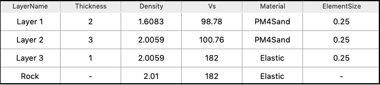

	Basic information of each layer

The detailed properties of the material in each soil layer are shown 
in :numref:`fig_l1`, :numref:`fig_l2` and :numref:`fig_l3`. 

.. 
    .. _fig_s3hark5:

    .. table::
        :class: borderless 

        +----------------------------------------+
        |.. _figa:                               |
        |                                        |
        |.. figure:: ../../images/layer1.png     |
        |   :align: center                       |
        |   :figclass: align-center              |
        |                                        |
        |   Layer 1                              |
        +----------------------------------------+
        |.. _figb:                               |
        |                                        |
        |.. figure:: ../../images/layer2.png     |
        |   :align: center                       |
        |   :figclass: align-center              |
        |                                        |
        |   Layer 2                              |
        +----------------------------------------+
        |.. _figc:                               |
        |                                        |
        |.. figure:: ../../images/layer3.png     |
        |   :align: center                       |
        |   :figclass: align-center              |
        |                                        |
        |   Layer 3                              |
        +----------------------------------------+

.. _fig_l1:                             
                                      
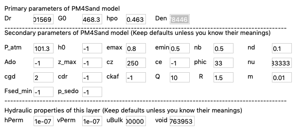
                                      
   Layer 1                            

.. _fig_l2:                             
                                      
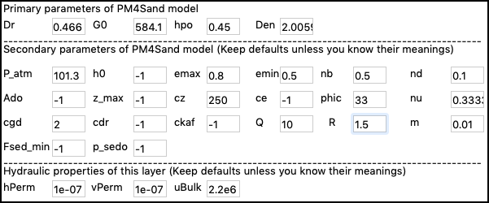
                                      
   Layer 2                            

.. _fig_l3:                             
                                      
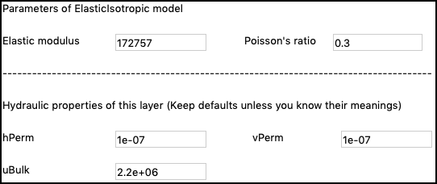

   Layer 3         
                                      

For the verification and validation purposes, |s3harkName|'s results are compared with FLAC an PLAXIS, 
as shown in :numref:`fig_s3hark7`.  
All three programs generally produce very similar response with
different levels of differences shown in PHA, maximum shear strain, CSR, maximum pore pressure ratio. 
The differences come from multiple sources, such as numerical discretization methods, solvers, etc.
For example, FLAC tends to produce higher dilation pulses in liquefied layer. 
This is possibly due to a combination of different reasons, e.g.,
interpolation of data from integration points at different
locations, numerical methods for integration, formulations for
solid fluid coupling, etc.
(Long Chen and Andrew Makdisi at University of Washington,  
Gregor Vilhar at PLAXIS BV, Chaofeng Wang at UC, Berkeley contributed to the verification of PM4Sand in |s3harkName|.)

.. _fig_s3hark7:                             
                                      
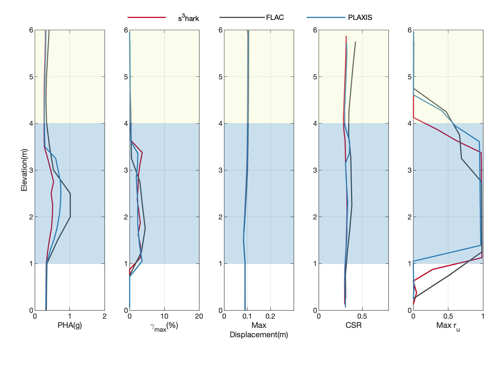

   Compare with FLAC and PLAXIS   

3D Column Bidirectional Shaking
---------------------------------

A 3D free field effective stress analysis is performed by |s3harkName|
and demonstrated here.  The results are verified against OpenSees.  
The soil column being analyzed is 30 meters high sitting on a
rock.  The ground water table is at 2 meters below the soil surface.
In the column, there are a total of three soil layers. Each layer is
meshed by elements with a size of 0.5 meter in height.  Basic
properties of soil layers and the rock are shown
in :numref:`s3harkSoilColumn3D` and :numref:`s3harklayers3D`.  
The layers are modeled by PDMY02 material.  
The rock layer will be simplified to a :cite:`Lysmer:1969` dashpot,
which accounts for the finite rigidity of the underlying elastic
medium.  The parameters of the dashpot are calculated solely based on
rock layer's density and :math:`V_{s30}`. 
The slope parameters are set to be 
:math:`\alpha=1.145762838175103^{\circ}` and :math:`\beta=-90^{\circ}`

.. _s3harkSoilColumn3D:                             
                                      
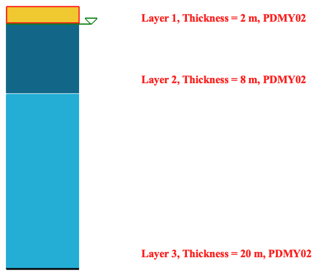

   Soil layers of a 3D column  

.. _s3harklayers3D:                              
                                      
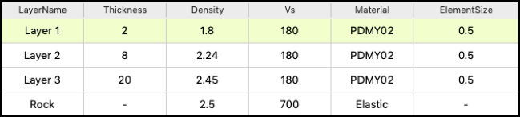

   Soil layers of a 3D column     

The simulation is described in a json file, which can be downloaded from :download:`this link <../../_static/files/s3hark-demo-3D-slope.json>`.
It includes all the configurations, the soil table and parameters for each layer - all the information needed to reproduce the simulation.
In |s3harkName|, go to the menu and choose to open and load this json file into the application, 
You'll see the detailed properties of the material in each soil layer as those shown 
in Figures :numref:`s3hark3DMatTabs_1`, :numref:`s3hark3DMatTabs_2`, :numref:`s3hark3DMatTabs_3` and :numref:`s3hark3DMatTabs_4`.

.. _s3hark3DMatTabs_1:                             
                                      
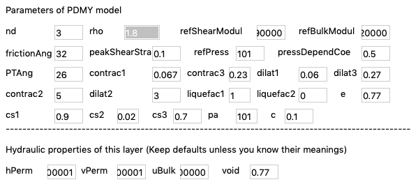

   Detail soil properties and material model parameters  of a 3D column: Layer 1

..
    .. _tab_param_layer1:

    .. list-table:: Model parameters and layer properties of a 3D column: Layer 1
       :widths: 25 25 25 25 
       :header-rows: 1

       * - Parameter
         - Value
         - Parameter
         - Value
       * - Dr
         - 0.47
         - PTAng
         - 26.0
       * - c
         - 0.1
         - contrac1
         - 0.067
       * - contrac2
         - 5.0
         - contrac3
         - 0.23
       * - cs1
         - 0.9
         - cs2
         - 0.02
       * - cs3
         - 0.7
         - dilat1
         - 0.06
       * - dilat2
         - 3.0
         - dilat3
         - 0.27
       * - e
         - 0.77
         - frictionAng
         - 32.0
       * - liquefac1
         - 1.0
         - liquefac2
         - 0.0
       * - nd
         - 3.0
         - noYieldSurf
         - 0.0
       * - pa
         - 101.0
         - peakShearStra
         - 0.1
       * - pressDependCoe
         - 0.5
         - refBulkModul
         - 220000.0
       * - refPress
         - 101.0
         - refShearModul
         - 90000.0
       * - rho
         - 1.8
         - type
         - PDMY02
       * - hPerm
         - 0.0981
         - uBulk
         - 2200000.0
       * - vPerm
         - 0.0981
         - void
         - 0.77

.. _s3hark3DMatTabs_2:                             
                                      
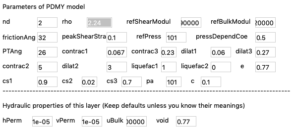

   Detail soil properties and material model parameters  of a 3D column: Layer 2

.. _s3hark3DMatTabs_3:                             
                                      
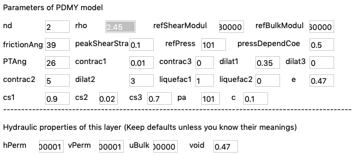

   Detail soil properties and material model parameters  of a 3D column: Layer 3 

.. _s3hark3DMatTabs_4:                             
                                      
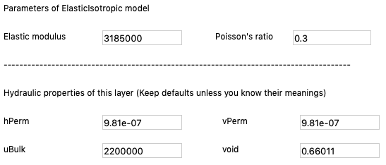

   Detail soil properties and material model parameters  of a 3D column: Rock

Download the ground motion file from :download:`this link <../../_static/files/SRT-GM-Input-yerbaNSvelocity-2DShaking.json>`. 
In the ``Configure`` tab, put the path of the downloaded motion file into ``Rock motion``.
Then, click the ``Analyze`` button to perform the simulation.
For the verification and validation purposes, |s3harkName|'s results are compared with OpenSees, 
as shown in :numref:`s3hark3DColumnResults`. 

.. _s3hark3DColumnResults:                             
                                      
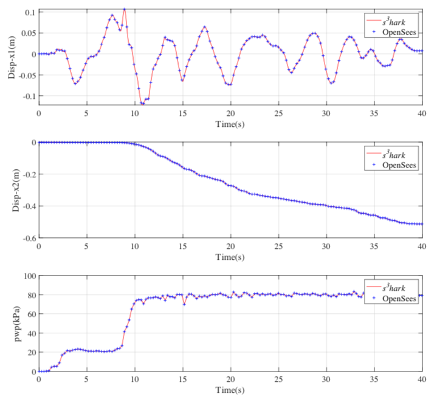

   Compare with OpenSees 

.. bibliography:: references.bib