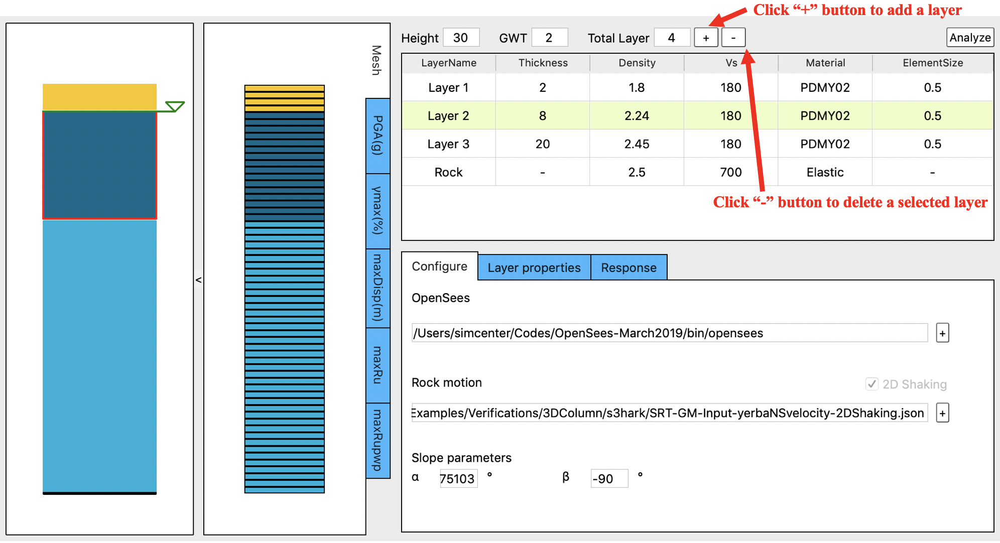
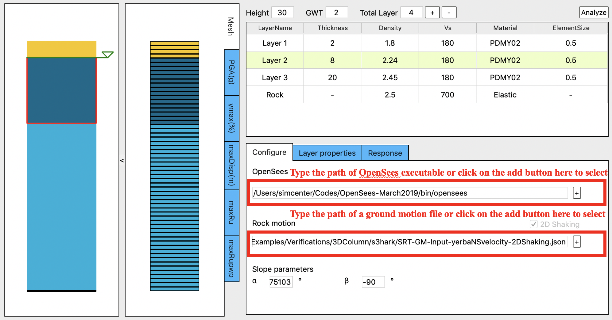
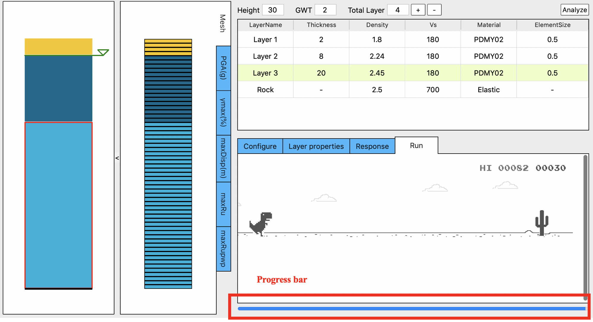
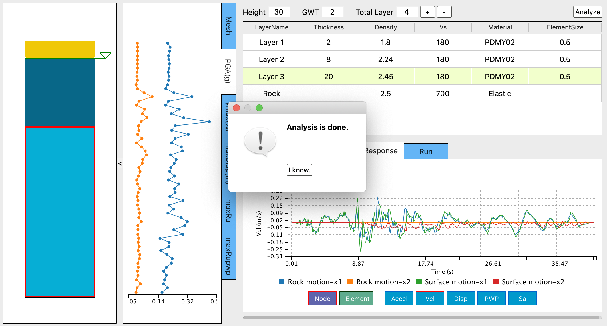

.. _lbl-installation:

Installation
=============

All SimCenter applications are available at the `SimCenter website <https://simcenter.designsafe-ci.org/>`_ under Research Tools. 
The following sections outline the steps necessary to download and install the |s3harkName| application. 
(Some of the SimCenter applications do require that you install a number of other applications that are needed to run the workflows on your local machine as well as at DesignSafe.)

Download
---------------------

To download the application navigate to the |s3harkName| page on `SimCenter website <https://simcenter.designsafe-ci.org/>`_ and click on the Download App & User Manual link on the right side of the page. This will bring you to another page which contains a list of downloadable files and directories.
There are four files available for download from this page:

    * The PDF file is the User Manual that you are reading now.
    * The MOV file is an video that provides an introduction to the usage of the application.
    * The ZIP file is an archive that contains the application files for a Windows operating system.
    * The DMG file is an archive that contains the application files for a Mac OS X operating system.

To download the s3hark application, click on the link for the appropriate file for your operating system and then click on the Download button at bottom right corner of the ensuing pop-up window to download it. 

Install
---------------------

You need to unpackage the application from the downloaded file and place it in a location on your filesystem. On Windows, we recommend that you create a C:/SimCenter/s3hark directory and extract the contents of the ZIP archive there. 
It is also recommended to run the included installer for Visual C/C++ runtime library(vc redist.x64.exe). On Mac, we recommend you copy the application to either your Documents folder or your Desktop folder. 
You are free to place the applications anywhere you wish, 
you will just need to make the appropriate adjustments with the following instructions if you do so.

Test
-----------------------------

.. _addLayer_img:

	Adding soil layers

Click on the configure tab to show configurations options. 

Under the ”OpenSees” label, type the path of OpenSees executable. You can also select the executable from your local computer by clicking on the ”+” button on the right of the input area (:numref:`addLayer_img`).

.. _addOpenSees_img:

	Adding OpenSees path and rock motion file

Under the ”Rock motion” label, type the path of a ground motion file. You can also select the file from your local computer by clicking on the ”+” button on the right of the input area (:numref:`addOpenSees_img`).

.. _progress_img:

	Simulation progress

Click on the ”Analyze” button to run the finite element analysis. 

If the soil layers are added successfully, OpenSees path is correct and the rock motion file is correct, you will see a progress bar (:numref:`progress_img`) displayed at the bottom of the right hand side of the app, which shows the percentage of steps performed.

.. _done_img:

	Analysis is done

Once the simulation is done, the ”Response” tab and the ”PGA(g)” profile plot will be displayed. At the same time, a pop up window showing ”The analysis is done.” will show up (:numref:`done_img`). And when you click ”I know.”, the progress bar will disappear.