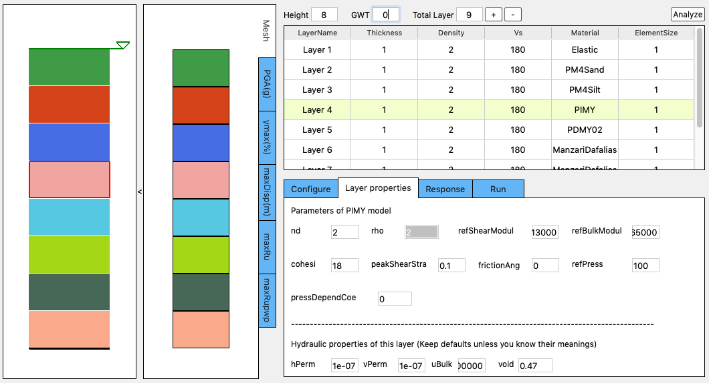
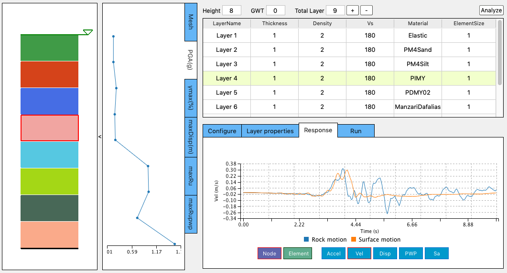
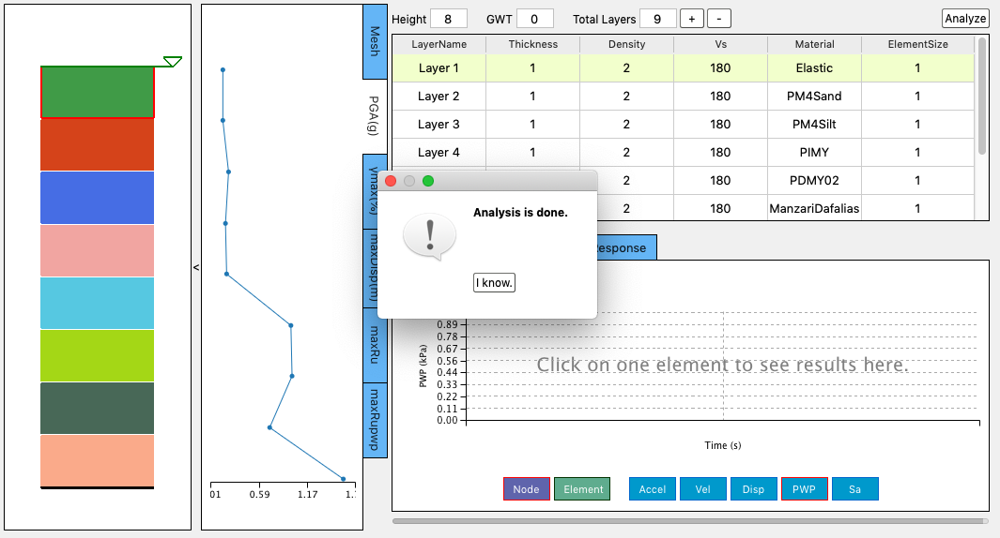
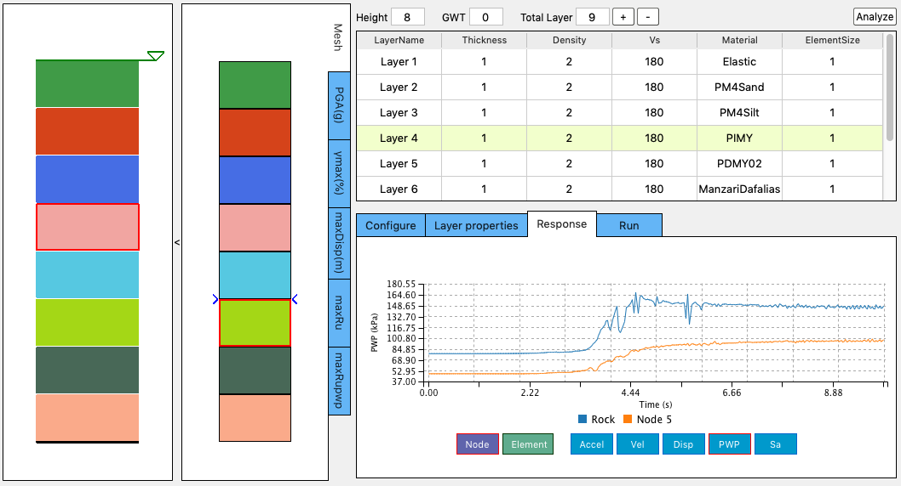
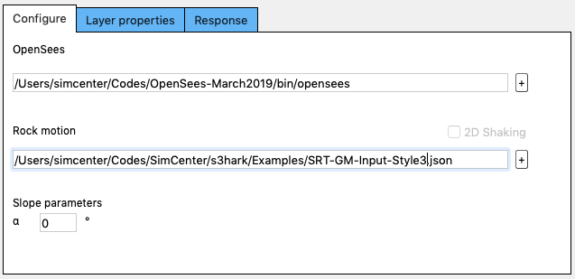
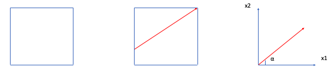
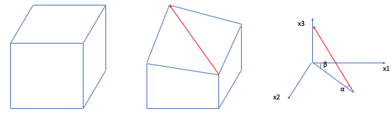

.. _lbl-usage:

Usage
================

|s3harkName| allows users to determine the event at the base of the building by performing an effective free-field site response analysis of a soil column. 
In this panel the user specifies a ground motion at the bottom of the soil column. 
After the soil layers have been properly defined, the motion at the ground surface are given at the end of the analysis 
and that motion can be used in the simulation of the building response.

The full user graphic interface looks like what is shown in :numref:`ui`

.. _ui:

	Full Graphic Interface

Clicking the arrow between the :ref:`Soil Column Graphic <profileColumn>` and the :ref:`FE Mesh Graphic <mesh>` will hide the FE Mesh Graphic, 
which makes the UI look like what is shown in :numref:`ui2`.

.. _ui2:

.. figure:: ../../../images/editing2.png
	:align: center
	:figclass: align-center

	Collapse Graphic Interface 

The UI of |s3harkName| consists of the following components:

.. _profileColumn:

Soil Column Graphic
---------------------
The first graphic on the left of the panel shows a visualization of the soil column created. 
Each layer has a different randomly generated color.
When the user add or delete a soil layer, this graphic will refresh. 

.. _mesh:

FE Mesh Graphic
---------------------
The second graphic on the left shows the finite element mesh and profile plots. 
Upon the finish of the analysis, selecting any of the tabs on the right inside this graphic (i.e., PGA, :math:`\gamma max`, maxDisp, maxRu, maxRuPWP) 
will show various results from the simulation at the mesh points.

Operations Area
---------------------
The right side of this area shows some information of the created soil column, such as the total height and number of soil layers.
The user also finds the Ground Water Table (GWT) input field, plus and minus buttons in this area.
If the user pressed the plus button, a layer will be added below a currently selected layer. 
If the minus button is pressed the currently selected layer will be removed. 
The GWT input field allows the user to specify the level of the ground water table.

.. note:: 

   - Variables are assumed to have m, kPa, and kN units in |s3harkName|.

Soil Layer Table
---------------------
This table is where the user provides the characteristics of soil layers, such as layer thickness, density, Vs30, material type, and element size in the finite element mesh.

Single click at a cell will make a soil layer selected, which will highlight the layer using green color in the table.

Also the layer will be highlighted by red box in the :ref:`Soil Column Graphic <profileColumn>`.

Meanwhile the :ref:`Layer Properties Tab <layerPropertiesTab>` will be activated.

Double click a cell to edit it in the table.

If you change the ``Material`` cell of a layer, the :ref:`Layer Properties Tab <layerPropertiesTab>` will change correspondingly.

Tabbed Area
---------------------
This area contains the three tabbed widgets described below.

Configure Tab
^^^^^^^^^^^^^^^^
This tab allows the user to specify the paths to the OpenSees executable and a ground motion file that represent the ground shaking at the
bedrock. The rock motion file must follow the SimCenter event format. 
Examples of SimCenter event files are available in the :download:`motion demos <../../../_static/files/DemoGM.zip>`. 
|s3harkName| will determine to use 2D column or 3D column based on the ground motion file provided. 
When a ground motion file is selected from the local computer, or the path of the ground motion file is typed in, 
|s3harkName| will figure out if it’s a 1D or 2D shaking file. If it’s 1D shaking, all elements will be 2D. If it’s 2D shaking, 
all elements will be 3D. 
The definition of 2D and 3D slope are different. See :numref:`slope-2d` and :numref:`slope-3d`.

More details about this tab can be found in :ref:`configure`.

.. _layerPropertiesTab:

Layer Properties Tab
^^^^^^^^^^^^^^^^^^^^^
This tab allows the user to enter additional material properties for the selected soil layer :numref:`layerEditing`.

.. _layerEditing:

	Layer properties

.. _responseTab:

Response Tab
^^^^^^^^^^^^^^^^^^^^^
Once the site response analysis has been performed, this tab provides information about element and nodal time varying response quantities. See :numref:`response`.

.. _response:

	Response

Analyze Button
---------------------
This ``Analyze`` button is located at the top-right corner of the UI and shall be used to run the simulation locally on your computer. 
A progress bar will show up at the bottom of the application indicating the status of the analysis. 
Upon the finish of the simulation, a message will be displayed (:numref:`done`). 

.. _done:

	Analysis is done

View Results
-----------------
Click the button to dismiss the message window, the response tab will be activated.

The user can click on any element in the mesh graphic, the selected element will be highlighted in red and the selected nodes will be pointed out by blue arrows. 

The time history of selected element / node will be shown in the :ref:`Response Tab <responseTab>`.

This allows the user to review the ground motion predicted at selected nodes :numref:`responseNode`.

.. _responseNode:

	Response at a selected node

.. note:: 

   - If the Analyze button is not pressed, no simulation will be performed,
     therefore no simulation is performed and there will be no ground motions provided to the building, if your are using |s3harkName| inside other SimCenter applications.

.. _configure:

Configure
-------------

.. _configure-1d:

	Configuration with a 1D shaking motion

In the configure tab, two paths need to be specified. 

You can either type them or click the '+' button to select them from your computer.

If you don't have OpenSees install, the instruction can be found :ref:`here <quickstart>`.
If you don't have a ground motion file, demos can be downloaded :download:`here <../../../_static/files/DemoGM.zip>`.

.. note:: 

   - Variables are assumed to have m, kPa, and kN units in |s3harkName|.    

The first demo is SRT-GM-Input-Style3.json, which contains the shaking motion in one direction (1D shaking). 
If you select this files as the input motion, your tab will look like the one shown in :numref:`configure-1d`. 
You can edit the slope degree :math:`\alpha`. For flat ground the value should be set as 0. 
If 1D shaking motion provided, |s3harkName| automatically treat the problem as a 2D plane strain problem. 
2D elements will be used. The slope diagram is plotted in :numref:`slope-2d`.

.. _slope-2d:

	Slope definition for 2D Column

The second demo is SRT-GM-Input-Style3-2D.json, which contains the shaking motion in two directions (2D shaking). 
If you select this file as the input motion, your tab will look like the one shown in :numref:`configure-2d`.

.. _configure-2d:

.. figure:: ../../../images/configure-2d.png
	:align: center
	:figclass: align-center

	Configuration with a bi-directional shaking motion

You can see |s3harkName| detected the file you provided is a 2D shaking, 
|s3harkName| automatically treat the problem as a 3D problem. 
3D elements will be used. The slope diagram is plotted in :numref:`slope-3d`:

.. _slope-3d:

	Slope definition for 3D Column

For flat ground :math:`\alpha` and :math:`\beta` should be set as 0. 
