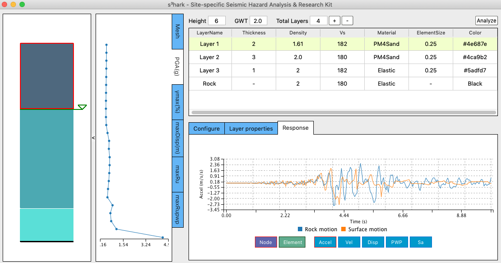

.. s3hark Application documentation master file, created by
   sphinx-quickstart on Mon Dec  9 12:35:25 2019.
   You can adapt this file completely to your liking, but it should at least
   contain the root `toctree` directive.

Site-specific Seismic Hazard Analysis & Research Kit (|appName|)
=====================================================================

What is |appName| 
---------------------------
|appName| is the acronym of site-specific seismic hazard analysis and research kit.  
This tool focuses on simulating wave propagation along soil depth using finite element (FE) method. 
The intended audience for s3hark is researchers and practitioners interested in performing site-specific analysis of soil in response to earthquakes, 
and educators interested in teaching site response analysis in their classes. 
The tool provides a friendly interface for users to input and modify soil layers using tables, 
while the built soil profile and the FE mesh being visualized simultaneously. 
Results including acceleration, velocity, displacement, pore pressure, spectral acceleration, etc., 
are visualized for the soil profile and for each node as well, from which the user can comprehend 
the wave propagation and liquefaction status along the soil depth. 

Features of |appName|
---------------------------
* 2D and 3D elements for dynamic analysis of fluid saturated porous media
* Advanced linear / nonlinear soil material models
* Total stress / effective stress analysis
* Bi-directional motions
* Flat / slope free field analysis
* Finite rigidity of the bedrock 

Available material models
---------------------------
.. list-table:: Available material models
   :widths: 25 25 50
   :header-rows: 1

   * - Material models
     - Usage
     - Development status
   * - ElasticIsotropic
     - 2D/3D
     - ✓
   * - PM4Sand
     - 2D
     - ✓
   * - PM4Silt
     - 2D
     - ✓
   * - PressureIndependMultiYield
     - 2D/3D
     - ✓
   * - PressureDependMultiYield
     - 2D/3D
     - ✓
   * - PressureDependMultiYield02
     - 2D/3D
     - ✓
   * - ManzariDafalias
     - 2D/3D
     - ✓
   * - Borja-Amies
     - 3D
     - ✓

.. _lbl-user-manual:

.. toctree::
   :caption: User Manual
   :maxdepth: 1
   :numbered: 2

   common/license
   common/user_manual/installation/installation
   common/user_manual/quickstart/quickstart
   common/user_manual/usage/usage
   common/user_manual/examples/examples
   common/user_manual/bugs
   

.. _lbl-technical-manual:

.. toctree::
   :caption: Technical Manual
   :maxdepth: 1
   :numbered: 2

   common/technical_manual/theory
   common/technical_manual/vnv

.. _lbl-developer-manual:

.. toctree::
   :caption: Developer Manual
   :maxdepth: 1
   :numbered: 2

   common/developer_manual/how_to_build/how_to_build
   common/developer_manual/architecture/architecture
   common/developer_manual/how_to_extend/how_to_extend
   common/developer_manual/coding_style/coding_style

How to cite
---------------------------

Charles Wang, Frank McKenna, Peter Mackenzie-Helnwein, Adam Zsarnoczay, Wael Elhaddad, Michael Gardner, & Pedro Arduino. (2019, October 11). 
NHERI-SimCenter/s3hark: Release v1.1.2 (Version 1.1.2). Zenodo. http://doi.org/10.5281/zenodo.3483211

License
---------------------------

The |s3harkName| application is distributed under the BSD 3-Clause license, see :ref:`lbl-license` for details.

Acknowledgement
---------------------------

This material is based upon work supported by the National Science Foundation under Grant No. 1612843. 
Any opinions, findings, and conclusions or recommendations expressed in this material are those of the authors and do 
not necessarily reflect the views of the National Science Foundation.

Contact
---------------------------
Charles Wang, NHERI SimCenter, University of California, Berkeley, c_w@berkeley.edu

